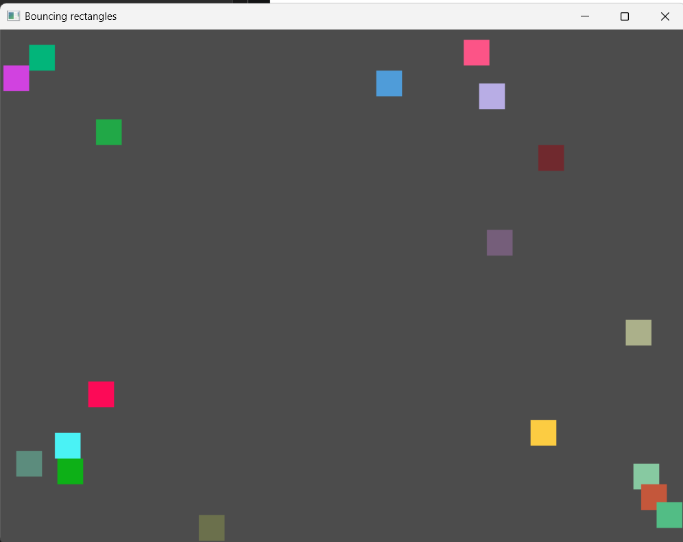
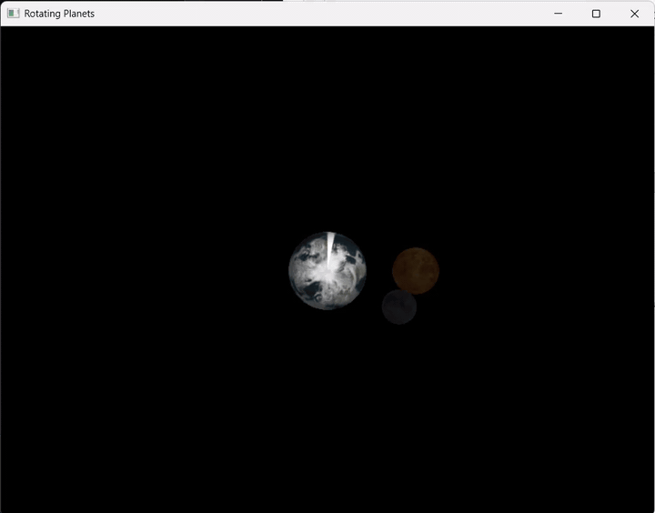
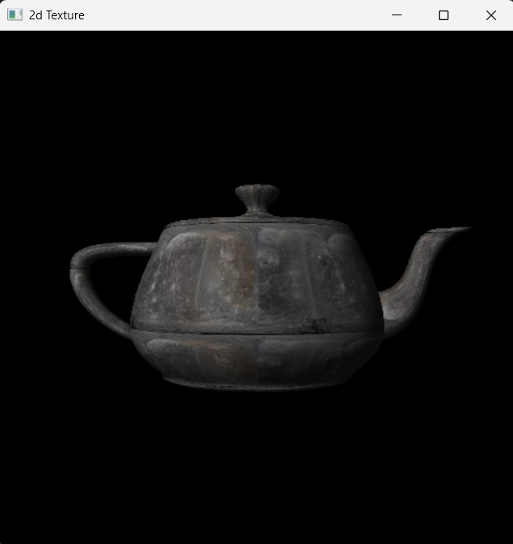

# OpenGL / GLUT Computer Graphics

Classic OpenGL의 고정 함수 파이프라인과 GLUT를 이용해 애니메이션, 조명, 텍스처 매핑을 학습한 C++ 예제 모음

| Bouncing rectangles | Rotating planets | Texture mapping |
| :---: | :---: | :---: |
|  |  |  |

## 사용해야 하는 GLUT

**classic GLUT 3.7 Win32(x86)** 를 사용합니다.

- 링크 라이브러리: `Glut/glut32.lib`
- 런타임 DLL: `Glut/glut32.dll`
- 헤더: `Glut/glut.h`
- 빌드 플랫폼:  **Win32**

### Homework

| 폴더 | 설명 |
| --- | --- |
| `CG_Homework01` | 무작위 색상·속도의 사각형들을 생성하고, 화면 경계 및 사각형 간 충돌을 처리합니다. 데이터, 로직, 렌더러를 클래스로 분리했습니다. |
| `CG_Homework02` | 정점·색상 배열과 `GL_QUADS`로 컬러 큐브를 만들고 깊이 테스트와 후면 컬링을 적용합니다. 방향키로 회전할 수 있습니다. |
| `CG_Homework03` | LodePNG로 세 행성의 텍스처를 읽고 GLU quadric sphere, 조명, 밉맵을 사용해 공전 애니메이션을 렌더링합니다. |
| `CG_Homework04` | OBJ 캐릭터 로딩, WASD 이동, `J` 점프, 레벨 진행 및 효과음을 포함한 간단한 3D 게임 루프입니다. |

### Practice

| 폴더 | 설명 |
| --- | --- |
| `CG_Practice01_InitialTest` | GLUT 창 생성, 배경색, 사각형 렌더링, 뷰포트와 직교 투영을 다룹니다. |
| `CG_Practice02_BounceRect` | 더블 버퍼링과 타이머 콜백으로 사각형 하나를 화면 경계에서 바운스합니다. |
| `CG_Practice03_DrawCone` | 두 개의 `GL_TRIANGLE_FAN`으로 원뿔을 만들고 우클릭 메뉴로 깊이 테스트, 컬링, 외곽선 표시를 전환합니다. |
| `CG_Practice04_DrawSpring` | `GL_POINTS`와 삼각함수로 3D 나선형 스프링의 정점을 생성하여 방향키로 회전합니다. |
| `CG_Practice05_Atom` | 구체로 원자핵과 전자를 만들고 타이머 콜백으로 전자 궤도 애니메이션을 재생합니다. |
| `CG_Practice06_Shade` | 꼭짓점별 RGB 색상과 `GL_SMOOTH`를 사용해 보간된 삼각형을 렌더링합니다. |
| `CG_Practice07_Light` | 고정 함수 조명, 재질, 깊이 테스트와 컬링을 적용한 제트 모델입니다. 방향키로 회전하고 `F1`/`F2`로 거리를 조절합니다. |
| `CG_Practice08_Texture` | LodePNG로 `2.png`를 읽어 GLUT 주전자에 매핑하고 조명, 래핑, 선형 필터링을 적용합니다. 방향키로 회전하고, `W`/`S` 거리를 조절합니다. |

## 참고 자료

- [Using OpenGL/GLUT callbacks with a C++ class](https://stackoverflow.com/questions/3589422/using-opengl-glutdisplayfunc-within-class)
- [Texturing a GLUT solid sphere](https://stackoverflow.com/questions/8251911/texturing-a-glutsolidsphere)
- [OpenGL Tutorial — Loading models with OBJ](https://www.opengl-tutorial.org/beginners-tutorials/tutorial-7-model-loading/)
